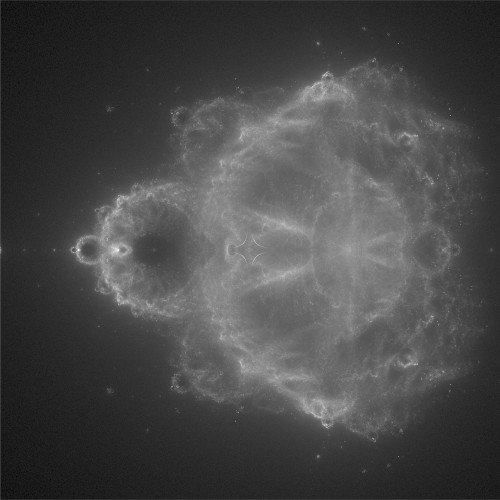

# Mandelbrot set explorer

## Prerequisites

You need SFML to compile the project

```
sudo apt-get install libsfml-dev
```

And boost library

```
sudo apt-get install libboost-all-dev
```

## Usage

navigation: arrow keys  
scale up: +  
scale down: -  
screenshot: s

note: buddhabrot generation is compute intensive so navigating may not be so easy

##Screenshots

 

